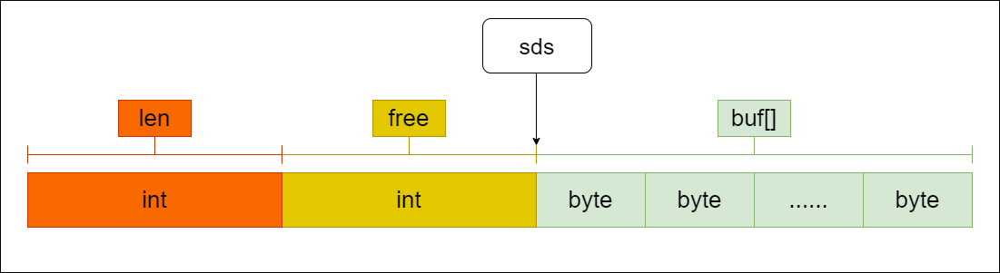

### Redis是什么

remote dictionary server

- 开源，基于BSD
- 基于内存
- 支持丰富的数据类型
- 支持事务
- 支持持久化
- 可扩展性
- 发布/订阅
- 哨兵模式
- ...

### 基础知识

- redis.conf
  ```c
  port 6379
  databases 16
  ```
  
- redis-server
  ```redis-server /usr/local/bin/config/redis.conf```指定配置启动redis服务
  
- redis-cli
`redis-cli -h 127.0.0.1 -p 6379 -a ******`

```bash
127.0.0.1:6379>
127.0.0.1:6379> ping
PONG
127.0.0.1:6379> select 1  # 切换到1号数据库
OK
127.0.0.1:6379[1]>        # 当前在1号数据库
```

### 数据类型

#### String

字符串。
##### set key value

```bash
127.0.0.1:6379> set name zhangsan
OK
```

##### get key
  ```bash
127.0.0.1:6379> get name
"zhangsan"
  ```

##### append key value
  ```bash
127.0.0.1:6379> get name
"zhangsan"
127.0.0.1:6379> append name -data
(integer) 13
127.0.0.1:6379> get name
"zhangsan-data"
  ```

##### incr key
  ```bash
127.0.0.1:6379> get age
"10"
127.0.0.1:6379> incr age
(integer) 11
  ```
##### expire key seconds
  ```bash
127.0.0.1:6379[1]> keys *        # 当前数据库中所有的key
1) "age"
127.0.0.1:6379[1]> expire age 10 # 设置age为10秒后过期
(integer) 1
127.0.0.1:6379[1]> ttl age       # ttl可以查看key的剩余生存时间
(integer) 7                      # 还有7秒后过期
127.0.0.1:6379[1]> ttl age
(integer) 4                      # 还有4秒后过期
127.0.0.1:6379[1]> ttl age
(integer) -2                     # 当值为-2时，说明key已经过期
127.0.0.1:6379[1]> keys *        # 当前数据库中的key已经为空
(empty array)
127.0.0.1:6379[1]> ttl name      # 不存在的key，同样ttl的值为-2
(integer) -2
  ```

##### setnx key value
  ```bash
127.0.0.1:6379> get name
"zhangsan"
127.0.0.1:6379> setnx name lisi
(integer) 0
127.0.0.1:6379> get name
"zhangsan"
127.0.0.1:6379> setnx name1 lisi
(integer) 1
127.0.0.1:6379> get name1
"lisi"
  ```

#### Hash
哈希表。所有hash的命令都是h开头的，如hget、hset、hdel等。

##### hset key field value [field value...]

```bash
127.0.0.1:6379> hset dict name aaa age 20
(integer) 2
```

##### hget key field

```bash
127.0.0.1:6379> hget dict name
"aaa"
```

#### List
命令都是以l开头的，如lpush，lpop等。
##### lpush key element [element ...]
  ```bash
127.0.0.1:6379> lpush list one
(integer) 1
127.0.0.1:6379> lpush list two
(integer) 2
127.0.0.1:6379> lpush list three
(integer) 3
127.0.0.1:6379> lrange list 0 -1
1) "three"
2) "two"
3) "one"
  ```
#### Set
集合类型也是用来保存多个字符串的元素，但和列表不同的是集合中
1.不允许有重复的元素
2.集合中的元素是无序的，不能通过索引下标获取元素
3.支持集合间的操作，可以取多个集合取交集、并集、差集。
命令都是以s开头的，如sadd，smembers等。

##### sadd key member [member...]
  ```bash
127.0.0.1:6379> sadd set one
(integer) 1
127.0.0.1:6379> sadd set two
(integer) 1
127.0.0.1:6379> sadd set one
(integer) 0
  ```

##### smembers key
  ```bash
127.0.0.1:6379> smembers set
1) "one"
2) "two"
  ```

#### ZSet
有序集合。每个元素都会关联一个double类型的分数，Redis通过这个分数来进行排序。当分数一样时，Redis默认使用字典序排序。
有序集合的命令都是 以z开头，zadd、zrange、zscore等。

##### zadd key score member [score member...]
```bash
127.0.0.1:6379> zadd zset 1 name1 2 name2
(integer) 2
```

##### zscore key member
```bash
127.0.0.1:6379> zadd zset 3 name2
(integer) 0
127.0.0.1:6379> zscore zset name2
"2"
```

### 用途

- 缓存
- 计数器
- 排行榜

### SDS

#### 什么是SDS？

SDS全称为简单动态字符串（**simple dynamic string**），是Redis封装出的一种数据结构类型，主要用于存储Redis的默认字符串表示。

#### SDS的实现

```c
// Redis3.0/6.0
typedef char *sds;
```

3.2之前，一种

```c
// Redis3.0
struct sdshdr {
    
    int len;  // buf 中已占用空间的长度
    
    int free;  // buf 中剩余可用空间的长度
   
    char buf[];  // 数据空间
};
```




3.2之后，区分了5种sds的类型：

```c
// Redis6.0
#define SDS_TYPE_5  0
#define SDS_TYPE_8  1
#define SDS_TYPE_16 2
#define SDS_TYPE_32 3
#define SDS_TYPE_64 4
```

```c
// Redis6.0
struct __attribute__ ((__packed__)) sdshdr5 {
    unsigned char flags; /* 3 lsb of type, and 5 msb of string length */
    char buf[];
};
struct __attribute__ ((__packed__)) sdshdr8 {
    uint8_t len; /* used */
    uint8_t alloc; /* excluding the header and null terminator */
    unsigned char flags; /* 3 lsb of type, 5 unused bits */
    char buf[];
};
struct __attribute__ ((__packed__)) sdshdr16 {
    uint16_t len; /* used */
    uint16_t alloc; /* excluding the header and null terminator */
    unsigned char flags; /* 3 lsb of type, 5 unused bits */
    char buf[];
};
struct __attribute__ ((__packed__)) sdshdr32 {
    uint32_t len; /* used */
    uint32_t alloc; /* excluding the header and null terminator */
    unsigned char flags; /* 3 lsb of type, 5 unused bits */
    char buf[];
};
struct __attribute__ ((__packed__)) sdshdr64 {
    uint64_t len; /* used */
    uint64_t alloc; /* excluding the header and null terminator */
    unsigned char flags; /* 3 lsb of type, 5 unused bits */
    char buf[];
};
```

不同长度的字符串可以使用不同大小的header，header部分主要包含以下几个部分(sdshdr5有所不同)：

- len：表示字符串真正的长度，不包括空终止字符
- alloc：表示字符串的最大容量，不含最后的"\0"
- flags：占用1个字节，最低的3bit表示header的类型

- ```__attribute__ ((__packed__))```取消字节对齐
- ```char buf[]```柔性数组
- sds指向的是buf数组地址，而非header的地址


```c
// Redis6.0

#define SDS_TYPE_MASK 7
#define SDS_HDR(T,s) ((struct sdshdr##T *)((s)-(sizeof(struct sdshdr##T))))

static inline size_t sdslen(const sds s) {
    unsigned char flags = s[-1];
    switch(flags&SDS_TYPE_MASK) {
        case SDS_TYPE_5:
            return SDS_TYPE_5_LEN(flags);
        case SDS_TYPE_8:
            return SDS_HDR(8,s)->len;
        case SDS_TYPE_16:
            return SDS_HDR(16,s)->len;
        case SDS_TYPE_32:
            return SDS_HDR(32,s)->len;
        case SDS_TYPE_64:
            return SDS_HDR(64,s)->len;
    }
    return 0;
}
```

```c
// Redis6.0
sds _sdsnewlen(const void *init, size_t initlen, int trymalloc) {
    void *sh;
    sds s;
    char type = sdsReqType(initlen);
    /* Empty strings are usually created in order to append. Use type 8
     * since type 5 is not good at this. */
    if (type == SDS_TYPE_5 && initlen == 0) type = SDS_TYPE_8;
    int hdrlen = sdsHdrSize(type);
    unsigned char *fp; /* flags pointer. */
    size_t usable;

    assert(initlen + hdrlen + 1 > initlen); /* Catch size_t overflow */
    sh = trymalloc?
        s_trymalloc_usable(hdrlen+initlen+1, &usable) :
        s_malloc_usable(hdrlen+initlen+1, &usable);
    if (sh == NULL) return NULL;
    if (init==SDS_NOINIT)
        init = NULL;
    else if (!init)
        memset(sh, 0, hdrlen+initlen+1);
    s = (char*)sh+hdrlen;
    fp = ((unsigned char*)s)-1;
    usable = usable-hdrlen-1;
    if (usable > sdsTypeMaxSize(type))
        usable = sdsTypeMaxSize(type);
    switch(type) {
        case SDS_TYPE_5: {
            *fp = type | (initlen << SDS_TYPE_BITS);
            break;
        }
        case SDS_TYPE_8: {
            SDS_HDR_VAR(8,s);
            sh->len = initlen;
            sh->alloc = usable;
            *fp = type;
            break;
        }
        case SDS_TYPE_16: {
            SDS_HDR_VAR(16,s);
            sh->len = initlen;
            sh->alloc = usable;
            *fp = type;
            break;
        }
        case SDS_TYPE_32: {
            SDS_HDR_VAR(32,s);
            sh->len = initlen;
            sh->alloc = usable;
            *fp = type;
            break;
        }
        case SDS_TYPE_64: {
            SDS_HDR_VAR(64,s);
            sh->len = initlen;
            sh->alloc = usable;
            *fp = type;
            break;
        }
    }
    if (initlen && init)
        memcpy(s, init, initlen);
    s[initlen] = '\0';
    return s;
}
```

字符串长度限制，默认512M

```c
// Redis6.0
static int checkStringLength(client *c, long long size) {
    if (!(c->flags & CLIENT_MASTER) && size > server.proto_max_bulk_len) {
        addReplyError(c,"string exceeds maximum allowed size (proto-max-bulk-len)");
        return C_ERR;
    }
    return C_OK;
}
```

#### SDS与C字符串的比较

**1）获取字符串长度的时间复杂度**

- C字符串获取字符串长度时间复杂度为O(N)。

- SDS获取字符串长度：O(1)。

  ```c
  static inline size_t sdslen(const sds s) {
      unsigned char flags = s[-1];
      switch(flags&SDS_TYPE_MASK) {
          case SDS_TYPE_5:
              return SDS_TYPE_5_LEN(flags);
          case SDS_TYPE_8:
              return SDS_HDR(8,s)->len;
          case SDS_TYPE_16:
              return SDS_HDR(16,s)->len;
          case SDS_TYPE_32:
              return SDS_HDR(32,s)->len;
          case SDS_TYPE_64:
              return SDS_HDR(64,s)->len;
      }
      return 0;
  }
  ```

**2）杜绝缓冲区溢出**

- C字符串不记录自身长度和空闲空间，容易造成缓冲区溢出。

- SDS拼接字符串之前会先检测剩余空间能否满足需求，不能满足需求的就会扩容。

  ```C
  // Redis6.0
  sds sdscatlen(sds s, const void *t, size_t len) {
      size_t curlen = sdslen(s);
  
      s = sdsMakeRoomFor(s,len);
      if (s == NULL) return NULL;
      memcpy(s+curlen, t, len);
      sdssetlen(s, curlen+len);
      s[curlen+len] = '\0';
      return s;
  }
  ```

**3）减少修改字符串时带来的内存重分配次数**

- C字符串每次进行增长或者缩短时，都会进行内存的重分配。

- SDS对内存分配实现了2种优化策略：空间的预分配和惰性空间释放。

  - 针对内存分配的策略

    在对SDS的空间进行扩展的时候，Redis不仅会为SDS分配修改所必须的空间，还会为SDS分配额外的未使用的空间，这样可以减少连续执行字符串操作所需的内存重分配次数。

    (1)当新分配的空间<1M时，每次再额外分配2倍的空间

    (2)当新分配的空间>=1M时，每次再额外分配1M空间

  ```c
  // Redis6.0
  #define SDS_MAX_PREALLOC (1024*1024)
  
  sds sdsMakeRoomFor(sds s, size_t addlen) {
      void *sh, *newsh;
      size_t avail = sdsavail(s);
      size_t len, newlen;
      char type, oldtype = s[-1] & SDS_TYPE_MASK;
      int hdrlen;
      size_t usable;
  
      /* Return ASAP if there is enough space left. */
      if (avail >= addlen) return s;
  
      len = sdslen(s);
      sh = (char*)s-sdsHdrSize(oldtype);
      newlen = (len+addlen);
      assert(newlen > len);   /* Catch size_t overflow */
      if (newlen < SDS_MAX_PREALLOC)
          newlen *= 2;
      else
          newlen += SDS_MAX_PREALLOC;
  
      type = sdsReqType(newlen);
  
      /* Don't use type 5: the user is appending to the string and type 5 is
       * not able to remember empty space, so sdsMakeRoomFor() must be called
       * at every appending operation. */
      if (type == SDS_TYPE_5) type = SDS_TYPE_8;
  
      hdrlen = sdsHdrSize(type);
      assert(hdrlen + newlen + 1 > len);  /* Catch size_t overflow */
      if (oldtype==type) {
          newsh = s_realloc_usable(sh, hdrlen+newlen+1, &usable);
          if (newsh == NULL) return NULL;
          s = (char*)newsh+hdrlen;
      } else {
          /* Since the header size changes, need to move the string forward,
           * and can't use realloc */
          newsh = s_malloc_usable(hdrlen+newlen+1, &usable);
          if (newsh == NULL) return NULL;
          memcpy((char*)newsh+hdrlen, s, len+1);
          s_free(sh);
          s = (char*)newsh+hdrlen;
          s[-1] = type;
          sdssetlen(s, len);
      }
      usable = usable-hdrlen-1;
      if (usable > sdsTypeMaxSize(type))
          usable = sdsTypeMaxSize(type);
      sdssetalloc(s, usable);
      return s;
  }
  ```

  - 针对内存释放的策略

    在对SDS的字符串进行缩短操作的时候，程序不会立即回收缩短之后多出来的字节，而是记录下来，等待下次使用，为将来可能有的增长操作提供了优化。

    如果我们在有需要的时候，也可以通过SDS的API来释放未使用的空间，不用担心惰性空间释放策略会造成内存浪费。

  ```c
  // Redis6.0
  void sdsclear(sds s) {
      sdssetlen(s, 0);
      s[0] = '\0';
  }
  
  static inline void sdssetlen(sds s, size_t newlen) {
      unsigned char flags = s[-1];
      switch(flags&SDS_TYPE_MASK) {
          case SDS_TYPE_5:
              {
                  unsigned char *fp = ((unsigned char*)s)-1;
                  *fp = SDS_TYPE_5 | (newlen << SDS_TYPE_BITS);
              }
              break;
          case SDS_TYPE_8:
              SDS_HDR(8,s)->len = newlen;
              break;
          case SDS_TYPE_16:
              SDS_HDR(16,s)->len = newlen;
              break;
          case SDS_TYPE_32:
              SDS_HDR(32,s)->len = newlen;
              break;
          case SDS_TYPE_64:
              SDS_HDR(64,s)->len = newlen;
              break;
      }
  }
  
  sds sdsRemoveFreeSpace(sds s) {...}
  ```

**4）二进制安全**

- C语言的字符串是以**'\0'**结尾的字符串数组来存储的，因此它不能用了存储任意的二进制数据。
- SDS是以长度字段来记录字符串数组的长度的，可存储任意的二进制数据。

**5）兼容部分C函数**

- strcasecmp、strcat

#### redisDb

```c
// Redis6.0
typedef struct redisDb {
    dict *dict;                 /* The keyspace for this DB */
    dict *expires;              /* Timeout of keys with a timeout set */
    dict *blocking_keys;        /* Keys with clients waiting for data (BLPOP)*/
    dict *ready_keys;           /* Blocked keys that received a PUSH */
    dict *watched_keys;         /* WATCHED keys for MULTI/EXEC CAS */
    int id;                     /* Database ID */
    long long avg_ttl;          /* Average TTL, just for stats */
    unsigned long expires_cursor; /* Cursor of the active expire cycle. */
    list *defrag_later;         /* List of key names to attempt to defrag one by one, gradually. */
} redisDb;
```
```c
// Redis6.0
typedef struct dict {
    dictType *type;
    void *privdata;
    dictht ht[2];
    long rehashidx; /* rehashing not in progress if rehashidx == -1 */
    int16_t pauserehash; /* If >0 rehashing is paused (<0 indicates coding error) */
} dict;
```
```c
// Redis6.0
typedef struct dictht {
    dictEntry **table;
    unsigned long size;
    unsigned long sizemask;
    unsigned long used;
} dictht;
```
```c
// Redis6.0
typedef struct dictEntry {
    void *key;
    union {
        void *val;
        uint64_t u64;
        int64_t s64;
        double d;
    } v;
    struct dictEntry *next;
} dictEntry;
```
```c
// Redis6.0
typedef struct redisObject {
    unsigned type:4;
    unsigned encoding:4;
    unsigned lru:LRU_BITS; /* LRU time (relative to global lru_clock) or
                            * LFU data (least significant 8 bits frequency
                            * and most significant 16 bits access time). */
    int refcount;
    void *ptr;
} robj;
```

