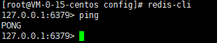

### 环境安装

#### Linux下安装

1. 前往[https://redis.io/download](https://redis.io/download)下载，当前最新版本为6.2.3

   

2. 将下载的```redis-6.2.3.tar.gz```上传到Linux的```/opt```目录下

3. 执行命令```cd /opt```切换到```opt```目录

4. 执行命令```tar xzf redis-6.2.3.tar.gz```解压压缩包

5. 执行命令```yum -y install gcc-g++``` 安装```gcc-g++```

6. 执行命令```cd /opt/redis-6.2.3```切换到```redis-6.2.3```目录

7. 执行命令```make```编译redis

8. 执行命令```make install```安装redis，```redis-benchmark```、  ```redis-check-aof```、  ```redis-check-rdb```、  ```redis-cli```、  ```redis-sentinel```、  ```redis-server```会被安装到```/usr/local/bin```目录下

9. 执行命令```cd /usr/local/bin```切换到```bin```目录

10. 执行命令```mkdir config```创建```config```目录

11. 执行命令```cp /opt/redis-6.2.3/redis.conf /usr/local/bin/config```将```redis.conf```拷贝到```/usr/local/bin/config```目录下

12. 执行命令```vi /usr/local/bin/config/redis.conf```修改```daemonize```为yes，设置为后台启动

    

13. 执行命令```redis-server /usr/local/bin/config/redis.conf```指定配置启动redis服务

14. 执行命令```ps -ef | grep redis```查看redis服务是否正常启动

    

15. 执行命令```redis-cli```连接redis

    

### 基础知识

##### select index

  Redis默认有16个数据库，默认使用第0个数据库，可以使用select切换数据库！

```bash
127.0.0.1:6379> select 1  # 切换到1号数据库
OK
127.0.0.1:6379[1]>        # 当前在1号数据库
```

##### dbsize

  获取当前DB存储的数目

```bash
127.0.0.1:6379[1]> set name zhangsan
OK
127.0.0.1:6379[1]> dbsize
(integer) 1
127.0.0.1:6379[1]> set age 1
OK
127.0.0.1:6379[1]> dbsize
(integer) 2
```

##### keys *

  查看当前数据库所有的key

```bash
127.0.0.1:6379[1]> keys *
1) "name"
2) "age"
```

##### flushdb

  清除当前数据库的所有数据（==**谨慎操作！**==）

##### flushall

  清除所有数据库的所有数据（**==谨慎操作！==**）

##### quit

  客户端断开与redis服务器的连接

  ```bash
127.0.0.1:6379[1]> quit
[root@VM-0-15-centos config]# 
  ```

##### shutdown

  关闭redis-server

  ```bash
127.0.0.1:6379> shutdown
not connected> quit
[root@VM-0-15-centos bin]# 
  ```

  查看当前redis服务状态

  


### 五大数据类型 ###

Redis is an open source (BSD licensed), in-memory data structure store, used as a database, cache, and message broker. Redis provides data structures such as strings, hashes, lists, sets, sorted sets with range queries, bitmaps, hyperloglogs, geospatial indexes, and streams. Redis has built-in replication, Lua scripting, LRU eviction, transactions, and different levels of on-disk persistence, and provides high availability via Redis Sentinel and automatic partitioning with Redis Cluster. [Learn more →](https://redis.io/topics/introduction)

Redis 是一个开源（BSD许可）的，内存中的数据结构存储系统，它可以用作<u>数据库</u>、<u>缓存</u>和<u>消息中间件</u>。 它支持多种类型的数据结构，如 [字符串（strings）](http://www.redis.cn/topics/data-types-intro.html#strings)， [散列（hashes）](http://www.redis.cn/topics/data-types-intro.html#hashes)， [列表（lists）](http://www.redis.cn/topics/data-types-intro.html#lists)， [集合（sets）](http://www.redis.cn/topics/data-types-intro.html#sets)， [有序集合（sorted sets）](http://www.redis.cn/topics/data-types-intro.html#sorted-sets) 与范围查询， [bitmaps](http://www.redis.cn/topics/data-types-intro.html#bitmaps)， [hyperloglogs](http://www.redis.cn/topics/data-types-intro.html#hyperloglogs) 和 [地理空间（geospatial）](http://www.redis.cn/commands/geoadd.html) 索引半径查询。 Redis 内置了 [复制（replication）](http://www.redis.cn/topics/replication.html)，[LUA脚本（Lua scripting）](http://www.redis.cn/commands/eval.html)， [LRU驱动事件（LRU eviction）](http://www.redis.cn/topics/lru-cache.html)，[事务（transactions）](http://www.redis.cn/topics/transactions.html) 和不同级别的 [磁盘持久化（persistence）](http://www.redis.cn/topics/persistence.html)， 并通过 [Redis哨兵（Sentinel）](http://www.redis.cn/topics/sentinel.html)和自动 [分区（Cluster）](http://www.redis.cn/topics/cluster-tutorial.html)提供高可用性（high availability）。

#### Redis-Key

##### set key value

  设置指定key的值为value

```bash
127.0.0.1:6379> set name zhangsan   # 设置key
OK
```

##### get key

  获取指定key的值

  ```bash
127.0.0.1:6379> get name
"zhangsan"
  ```

##### exists key

  判断key是否存在

  ```bash
127.0.0.1:6379> exists name
(integer) 1
127.0.0.1:6379> exists name1
(integer) 0
  ```

##### keys pattern

  查找所有符合给定模式pattern的key

  ```bash
127.0.0.1:6379> keys *
1) "name"
2) "age"
  ```

##### del key [key...]

  删除key

  ```bash
127.0.0.1:6379> keys *
1) "name"
2) "age"
127.0.0.1:6379> del name
(integer) 1
127.0.0.1:6379> keys *
1) "age"
127.0.0.1:6379> get name
(nil)
  ```

##### move key db

  将当前数据库中的key移动到给定的数据库db中

  ```bash
127.0.0.1:6379> keys *           # 当前数据库中所有的key
1) "age"
127.0.0.1:6379> move age 0       # 移动的数据库和当前的一样时报错
(error) ERR source and destination objects are the same
127.0.0.1:6379> move age 1       # 移动age到数据库1中
(integer) 1
127.0.0.1:6379> keys *           # 当前数据库已经为空
(empty array)
127.0.0.1:6379> select 1         # 切换到1号数据库
OK
127.0.0.1:6379[1]> keys *        # 查看1号数据库中，已有age这个key
1) "age"
  ```

##### expire key seconds

  设置key在seconds后过期，单位：秒

  ```bash
127.0.0.1:6379[1]> keys *        # 当前数据库中所有的key
1) "age"
127.0.0.1:6379[1]> expire age 10 # 设置age为10秒后过期
(integer) 1
127.0.0.1:6379[1]> ttl age       # ttl可以查看key的剩余生存时间
(integer) 7                      # 还有7秒后过期
127.0.0.1:6379[1]> ttl age
(integer) 4                      # 还有4秒后过期
127.0.0.1:6379[1]> ttl age
(integer) -2                     # 当值为-2时，说明key已经过期
127.0.0.1:6379[1]> keys *        # 当前数据库中的key已经为空
(empty array)
127.0.0.1:6379[1]> ttl name      # 不存在的key，同样ttl的值为-2
(integer) -2
  ```

##### expireat key timestamp

  设置key在timestamp这个时间戳后过期，单位：秒

##### pexpire key milliseconds

  设置key在milliseconds后过期，单位：毫秒

##### pexpireat key milliseconds-timestamp

  设置key在milliseconds-timestamp这个时间戳后过期，timestamp为时间戳，单位：毫秒

##### ttl key

  返回key的剩余生存时间(TTL，time to live)，单位：秒

##### pttl key

  返回key的剩余生存时间(TTL，time to live)，单位：毫秒

##### persist key

  移除key的过期时间，key将永不过期

##### randomkey

  从当前数据库中随机返回一个key

  ```bash
127.0.0.1:6379[1]> keys *
1) "sex"
2) "name"
127.0.0.1:6379[1]> randomkey
"sex"
127.0.0.1:6379[1]> randomkey
"name"
  ```

##### rename key newkey

  修改key的名称为newkey

  ```bash
127.0.0.1:6379[1]> keys *
1) "name"
127.0.0.1:6379[1]> rename name age
OK
127.0.0.1:6379[1]> keys *
1) "age"
  ```

##### renamenx key newkey

  当且仅当newkey不存在时，将key改名为newkey

  ```bash
127.0.0.1:6379[1]> keys *
1) "name"
2) "age"
127.0.0.1:6379[1]> renamenx aaa bbb   # 重命名一个不存在的key将报错
(error) ERR no such key
127.0.0.1:6379[1]> renamenx age name  # 将age重命名为name
(integer) 0                           # 因为name已经存在，所以重命名失败
127.0.0.1:6379[1]> keys *
1) "name"
2) "age"
127.0.0.1:6379[1]> renamenx age sex   # 将age重命名为sex，而sex这个key不存在，重命名成功
(integer) 1
127.0.0.1:6379[1]> keys *
1) "sex"
2) "name"
  ```

##### scan cursor [MATCH pattern] [COUNT count] [TYPE type]

##### type key

  返回key所存储的值的类型

  ```bash
127.0.0.1:6379> type name
string
127.0.0.1:6379> type age
string
  ```

#### String

##### set key value

  设置指定key的值为value

  ```bash
127.0.0.1:6379> set name zhangsan   # 设置key
OK
  ```

##### get key

  获取指定key的值

  ```bash
127.0.0.1:6379> get name
"zhangsan"
  ```

##### getset key value

  将给定key的值设置为value，并返回设置前key的值

  ```bash
127.0.0.1:6379> getset age 10
(nil)
127.0.0.1:6379> getset age 12
"10"
  ```

##### mset key value [key value ...]

  同时设置多个key的值

  ```bash
127.0.0.1:6379> mset name zhangsan age 10
OK
  ```

##### mget key [key...]

  同时获取多个key的值

  ```bash
127.0.0.1:6379> mget name age
1) "zhangsan"
2) "10"
  ```

##### setex key seconds value

  设置key的值为value，并设置过期时间为seconds(以秒为单位)

  ```bash
127.0.0.1:6379> setex name 10 zhangsan
OK
127.0.0.1:6379> ttl name
(integer) 6
  ```

##### setnx key value

  当key不存在时，设置key的值为value，若key存在，则不设置

  ```bash
127.0.0.1:6379> get name
"zhangsan"
127.0.0.1:6379> setnx name lisi
(integer) 0
127.0.0.1:6379> get name
"zhangsan"
127.0.0.1:6379> setnx name1 lisi
(integer) 1
127.0.0.1:6379> get name1
"lisi"
  ```

##### msetnx key value [key value ...]

  同时设置多个值，当且仅当所有的key都不存在时才能设置成功，否则设置失败。

  ```bash
127.0.0.1:6379> keys *
1) "name"
2) "age"
127.0.0.1:6379> msetnx k1 v1 name lisi
(integer) 0
127.0.0.1:6379> keys *
1) "name"
2) "age"
127.0.0.1:6379> msetnx k1 v1 k2 v2
(integer) 1
127.0.0.1:6379> keys *
1) "k2"
2) "k1"
3) "name"
4) "age"
  ```

##### strlen key

  返回key所存储的字符串的长度

  ```bash
127.0.0.1:6379> get name
"zhangsan"
127.0.0.1:6379> strlen name
(integer) 8
  ```

##### append key value

  如果key存在并且值是一个字符串，则将value追加到值的末尾

  ```bash
127.0.0.1:6379> get name
"zhangsan"
127.0.0.1:6379> append name -data
(integer) 13
127.0.0.1:6379> get name
"zhangsan-data"
  ```

##### incr key

  将key中存储的数字值增加1

  ```bash
127.0.0.1:6379> get age
"10"
127.0.0.1:6379> incr age
(integer) 11
  ```

##### incrby key increment

  将key中存储的数字值增加一个增量increment（整数）

  ```bash
127.0.0.1:6379> get age
"11"
127.0.0.1:6379> incrby age 3
(integer) 14
127.0.0.1:6379> incrby age -1
(integer) 13
  ```

##### incrbyfloat key increment

  将key中存储的数字值增加一个增量increment（浮点数）

  ```bash
127.0.0.1:6379> get age
"13"
127.0.0.1:6379> incrbyfloat age 1.2
"14.2"
127.0.0.1:6379> incrbyfloat age -1.2
"13"
  ```

##### decr key

  将key中存储的数字值减少1

  ```bash
127.0.0.1:6379> get age
"13"
127.0.0.1:6379> decr age
(integer) 12
  ```

##### decrby key decrement

  将key中存储的数字值减少一个减量increment（整数），若increment为负数，则为增加

  ```bash
127.0.0.1:6379> get age
"12"
127.0.0.1:6379> decrby age 2
(integer) 10
127.0.0.1:6379> decrby age -3
(integer) 13
  ```

##### setrange key offset value

  从偏移量offset开始，将value覆写到key所存储的字符串值

##### getrange key start end

  获取key中字符串值的子字符[start, end]，闭区间

  ```bash
127.0.0.1:6379[1]> get name
"zhangsan"
127.0.0.1:6379[1]> getrange name 1 3
"han"
127.0.0.1:6379[1]> getrange name 1 -1
"hangsan"
  ```

##### setbit key offset value

##### getbit key offset

#### List

Redis列表是一个双向列表，你可以往列表的头部（左边）或者列表的尾部（右边）插入元素。

一个列表最多可以包含2^32^-1（4294967295，42亿）个元素

##### lpush key element [element ...]

  将一个或多个值插入到列表的头部（左边）

  ```bash
127.0.0.1:6379> lpush list one
(integer) 1
127.0.0.1:6379> lpush list two
(integer) 2
127.0.0.1:6379> lpush list three
(integer) 3
127.0.0.1:6379> lrange list 0 -1
1) "three"
2) "two"
3) "one"
  ```

##### lpop key [count]

  从左边移除并获取列表的count（默认为1）个元素

  ```bash
127.0.0.1:6379> lrange list 0 -1
1) "three"
2) "two"
3) "one"
127.0.0.1:6379> lpop list
"three"
127.0.0.1:6379> lpop list 2
1) "two"
2) "one"
127.0.0.1:6379> lrange list 0 -1
(empty array)
  ```

##### llen key

  获取列表长度

  ```bash
127.0.0.1:6379> lrange list 0 -1
1) "three"
2) "two"
3) "one"
127.0.0.1:6379> llen list
(integer) 3
  ```

##### lindex key index

  通过索引获取列表中的元素

  ```bash
127.0.0.1:6379> lrange list 0 -1
1) "three"
2) "two"
3) "one"
127.0.0.1:6379> lindex list 0
"three"
127.0.0.1:6379> lindex list -1
"one"
127.0.0.1:6379> lindex list 2
"one"
  ```

##### lrange key start stop

  获取列表指定范围内的元素[start，stop]，闭区间

  ```bash
127.0.0.1:6379> lrange list 0 -1
1) "three"
2) "two"
3) "one"
127.0.0.1:6379> lrange list 0 1
1) "three"
2) "two"
  ```

##### lrem key count element

  移除指定的key对应的列表中值为value的至多count个元素。

  - 当count>0：从左往右移除值为value的至多count个元素
  - 当count<0：从右往左移除值为value的至多count个元素
  - 当count=0：移除所有值为value的元素

  ```bash
127.0.0.1:6379> lrange list 0 -1
1) "two"
2) "three"
3) "two"
4) "one"
127.0.0.1:6379> lrem list 1 one
(integer) 1
127.0.0.1:6379> lrange list 0 -1
1) "two"
2) "three"
3) "two"
127.0.0.1:6379> lrem list 2 two
(integer) 2
127.0.0.1:6379> lrange list 0 -1
1) "three"
127.0.0.1:6379> lrem list 2 three
(integer) 1
127.0.0.1:6379> lrange list 0 -1
(empty array)
  ```

##### linset key BEFORE|AFTER pivot element

  在列表的元素前或者后插入元素

  ```bash
127.0.0.1:6379> lrange list 0 -1
1) "three"
2) "two"
3) "one"
4) "four"
127.0.0.1:6379> linsert list before two aaa
(integer) 5
127.0.0.1:6379> lrange list 0 -1
1) "three"
2) "aaa"
3) "two"
4) "one"
5) "four"
127.0.0.1:6379> linsert list after two bbb
(integer) 6
127.0.0.1:6379> lrange list 0 -1
1) "three"
2) "aaa"
3) "two"
4) "bbb"
5) "one"
6) "four"
  ```

##### lpushx key element [element ...]

  将元素插入到已经存在的key的列表左边，如key不存在，则不插入

  ```bash
127.0.0.1:6379> lrange list 0 -1
1) "two"
2) "one"
127.0.0.1:6379> keys *
1) "list"
127.0.0.1:6379> lpushx listxxx aaa
(integer) 0
127.0.0.1:6379> keys *
1) "list"
127.0.0.1:6379> lpushx list bbb
(integer) 3
127.0.0.1:6379> keys *
1) "list"
127.0.0.1:6379> lrange list 0 -1
1) "bbb"
2) "two"
3) "one"
  ```

##### rpush key element [element...]

  将一个或多个元素插入到列表的尾部（右边）

  ```bash
127.0.0.1:6379> lrange list 0 -1
(empty array)
127.0.0.1:6379> lpush list one
(integer) 1
127.0.0.1:6379> lpush list two
(integer) 2
127.0.0.1:6379> lpush list three
(integer) 3
127.0.0.1:6379> rpush list four
(integer) 4
127.0.0.1:6379> lrange list 0 -1
1) "three"
2) "two"
3) "one"
4) "four"
  ```

##### rpop key [count]

  从右边移除并获取列表的count（默认为1）个元素

  ```bash
127.0.0.1:6379> lrange list 0 -1
1) "three"
2) "two"
3) "one"
4) "four"
127.0.0.1:6379> rpop list 2
1) "four"
2) "one"
127.0.0.1:6379> lrange list 0 -1
1) "three"
2) "two"
127.0.0.1:6379> rpop list 100
1) "two"
2) "three"
127.0.0.1:6379> lrange list 0 -1
(empty array)
  ```

##### lset key index element

  设置列表中索引为index的值为value

  ```bash
127.0.0.1:6379> lrange list 0 -1
1) "three"
2) "two"
3) "one"
4) "four"
127.0.0.1:6379> lset list 1 aaa
OK
127.0.0.1:6379> lrange list 0 -1
1) "three"
2) "aaa"
3) "one"
4) "four"
  ```

##### ltrim key start stop

  裁剪列表的值[start，stop]，闭区间

  ```bash
127.0.0.1:6379> lrange list 0 -1
1) "three"
2) "aaa"
3) "one"
4) "four"
127.0.0.1:6379> ltrim list 1 3
OK
127.0.0.1:6379> lrange list 0 -1
1) "aaa"
2) "one"
3) "four"
  ```

##### blpop key [key...] timeout

  从左边移除列表的第一个元素，如果没有元素会阻塞列表直到等待超时或者发现可弹出元素为止

##### brpop key [key...] timeout

  从右边移除列表的第一个元素，如果没有元素会阻塞列表直到等待超时或者发现可弹出元素为止

##### brpoplpush source destination timeout

  从列表source的右边弹出一个值，并插入destination的左边，如果列表没有元素则会阻塞列表直到等待超时或者发现可弹出元素为止

#### Set

Redis的Set是String类型的无序集合。集合中不会出现重复的数据。Redis中的集合是通过哈希表实现的，所以添加、删除、查找的时间复杂度都是O(1)。Redis集合的最大成员数为2^32^-1(40亿)

##### sadd key member [member...]

  向集合添加一个或者多个成员

  ```bash
127.0.0.1:6379> sadd set one
(integer) 1
127.0.0.1:6379> sadd set two
(integer) 1
127.0.0.1:6379> sadd set one
(integer) 0
  ```

##### scard key

  获取集合的成员数量

  ```bash
127.0.0.1:6379> scard set
(integer) 2
  ```

##### smembers key

  返回给定集合的所有成员

  ```bash
127.0.0.1:6379> smembers set
1) "one"
2) "two"
  ```

##### sismember key member

  判断member是否是集合key的成员

  ```bash
127.0.0.1:6379> smembers set
1) "one"
2) "two"
127.0.0.1:6379> sismember set one
(integer) 1
127.0.0.1:6379> sismember set one1
(integer) 0
  ```

##### srem key member [member...]

  移除集合中的一个或多个元素

  ```bash
127.0.0.1:6379> smembers set
1) "one"
2) "two"
127.0.0.1:6379> srem set one
(integer) 1
127.0.0.1:6379> smembers set
1) "two"
  ```

##### spop key [count]

  移除并返回集合中的随机count(默认为1)个元素

  ```bash
127.0.0.1:6379> smembers set
1) "one"
2) "two"
127.0.0.1:6379> spop set
"two"
127.0.0.1:6379> smembers set
1) "one"
  ```

##### srandmember key [count]

  返回集合中的count(默认为1)个随机元素

  ```bash
127.0.0.1:6379> smembers set
1) "one"
2) "three"
3) "two"
127.0.0.1:6379> srandmember set
"two"
127.0.0.1:6379> srandmember set 2
1) "one"
2) "three"
  ```

##### sdiff key [key...]

  返回第一个集合和其他集合之间的差集

  ```bash
127.0.0.1:6379> smembers set12
1) "one"
2) "two"
127.0.0.1:6379> smembers set13
1) "one"
2) "three"
127.0.0.1:6379> sdiff set12 set13
1) "two"
127.0.0.1:6379> sdiff set12
1) "one"
2) "two"
  ```

##### sdiffstore destination key [key...]

  将第一个集合与其他集合的差集存在destination中

  ```bash
127.0.0.1:6379> smembers set12
1) "one"
2) "two"
127.0.0.1:6379> smembers set13
1) "one"
2) "three"
127.0.0.1:6379> sunion set12 set13
1) "one"
2) "three"
3) "two"
127.0.0.1:6379> sdiffstore setdiff set12 set13
(integer) 1
127.0.0.1:6379> smembers setdiff
1) "two"
  ```

##### sunion key [key...]

  返回所有给定集合的并集

  ```bash
127.0.0.1:6379> smembers set12
1) "one"
2) "two"
127.0.0.1:6379> smembers set13
1) "one"
2) "three"
127.0.0.1:6379> sunion set12 set13
1) "one"
2) "three"
3) "two"
  ```

##### sunionstore destination key [key...]

  将所有给定集合的并集存储在destination中

  ```bash
127.0.0.1:6379> smembers set12
1) "one"
2) "two"
127.0.0.1:6379> smembers set13
1) "one"
2) "three"
127.0.0.1:6379> sunionstore setunion set12 set13
(integer) 3
127.0.0.1:6379> smembers setunion
1) "one"
2) "three"
3) "two"
  ```

##### sinter key [key...]

  返回所有集合的交集

  ```bash
127.0.0.1:6379> smembers set12
1) "one"
2) "two"
127.0.0.1:6379> smembers set13
1) "one"
2) "three"
127.0.0.1:6379> sinter set12 set13
1) "one"
127.0.0.1:6379> smembers set4
1) "four"
127.0.0.1:6379> sinter set12 set13 set4
(empty array)
  ```

##### sinterstore destination key [key...]

  将所有集合的交集存储在destination中

```bash
127.0.0.1:6379> sinterstore setinter set12 set13
(integer) 1
127.0.0.1:6379> smembers setinter
1) "one"
```

##### smove source destination member

  将member从source集合移动到destination集合

```bash
127.0.0.1:6379> smembers set12
1) "one"
2) "two"
127.0.0.1:6379> smembers set13
1) "one"
2) "three"
127.0.0.1:6379> smove set12 set13 two
(integer) 1
127.0.0.1:6379> smembers set13
1) "one"
2) "two"
3) "three"
```

##### sscan key coursor [MATCH pattern] [COUNT count]

  迭代集合中的元素

#### Hash

Redis Hash是一个string类型的field和value的映射表。每个hash可以存储2^32^-1(40亿)个键值对。

##### hset key field value [field value...]

  将一个或多个field-value设置到hash表中，返回值为新的field的个数

```bash
127.0.0.1:6379> hset dict name aaa age 20
(integer) 2
```

##### hmset key field value [field value...]

  将一个或多个field-value设置到hash表中

```bash
127.0.0.1:6379> hmset dict name aaa age 20
OK
```

##### hsetnx key field value

  当字段不存在哈希表中时才设置值

```bash
127.0.0.1:6379> hgetall dict
1) "name"
2) "aaa"
3) "age"
4) "20"
127.0.0.1:6379> hsetnx dict name bbb
(integer) 0
127.0.0.1:6379> hsetnx dict sex 1
(integer) 1
127.0.0.1:6379> hgetall dict
1) "name"
2) "aaa"
3) "age"
4) "20"
5) "sex"
6) "1"
```


##### hget key field

  获取哈希表中给定字段的值

```bash
127.0.0.1:6379> hget dict name
"aaa"
```

##### hmget key field [field...]

  获取哈希表中给定字段的值

```bash
127.0.0.1:6379> hmget dict name age
1) "aaa"
2) "20"
```

##### hdel key field [field...]

  删除一个或多个哈希表字段

```bash
127.0.0.1:6379> hkeys dict
1) "name"
2) "age"
3) "sex"
127.0.0.1:6379> hdel dict name age
(integer) 2
127.0.0.1:6379> hkeys dict
1) "sex"
```

##### hgetall key

  获取哈希表中的所有字段和值

```bash
127.0.0.1:6379> hgetall dict
1) "name"
2) "aaa"
3) "age"
4) "20"
```

##### hlen key

  获取哈希表中字段的数量

```bash
127.0.0.1:6379> hlen dict
(integer) 2
```

##### hexists key field

  查看哈希表中指定的字段是否存在

```bash
127.0.0.1:6379> hexists dict age
(integer) 1
```

##### hkeys key

  获取哈希表的所有字段

```bash
127.0.0.1:6379> hkeys dict
1) "name"
2) "age"
```

##### hvals key

  获取哈希表的所有的值

```bash
127.0.0.1:6379> hvals dict
1) "aaa"
2) "20"
```

##### hincrby key field increment

  为哈希表中的指定字段的整数值加上一个增量

```bash
127.0.0.1:6379> hget dict age
"20"
127.0.0.1:6379> hincrby dict age 2
(integer) 22
127.0.0.1:6379> hget dict age
"22"

```

##### hincrbyfloat key field increment

  为哈希表中的指定字段的浮点值加上一个增量

```bash
127.0.0.1:6379> hget dict age
"22"
127.0.0.1:6379> hincrbyfloat dict age 1.1
"23.1"
127.0.0.1:6379> hget dict age
"23.1"
```

##### hscan key cursor [MATCH pattern] [COUNT count]

  迭代哈希表中的键值对

#### ZSet

Redis中的ZSet是有序的集合。每个元素都会关联一个double类型的分数，Redis通过这个分数来进行排序。当分数一样时，Redis默认使用字典序排序。

##### zadd key score member [score member...]

  向有序集合中添加一个或多个成员，或者更新已经存在的成员的分数

```bash
127.0.0.1:6379> zadd zset 1 name1 2 name2
(integer) 2
```

##### zscore key member

  返回有序集合中成员的分数

```bash
127.0.0.1:6379> zadd zset 3 name2
(integer) 0
127.0.0.1:6379> zscore zset name2
"3"
```

##### zcard key

  返回有序集合的成员数量

```bash
127.0.0.1:6379> zcard zset
(integer) 2
```

##### zrange key start stop

  通过索引区间[start, stop]返回有序集合中的成员

```bash
127.0.0.1:6379> zrange zset 0 -1
1) "name1"
2) "name2"
127.0.0.1:6379> zrange zset 0 0
1) "name1"
```

##### zcount key min max

  返回分数在[min, max]之间的成员个数

```bash
127.0.0.1:6379> zcount zset 10 20
(integer) 0
127.0.0.1:6379> zcount zset 0 10
(integer) 2
```

##### zrank key member

  返回有序集合中指定成员的索引

```bash
127.0.0.1:6379> zrank zset name1
(integer) 0
127.0.0.1:6379> zrank zset name2
(integer) 1
```

##### zrem key member [member...]

  移除有序集合中一个或多个成员

```bash
127.0.0.1:6379> zrange zset 0 -1
1) "name1"
2) "name2"
127.0.0.1:6379> zrem zset name2
(integer) 1
127.0.0.1:6379> zrange zset 0 -1
1) "name1"
```

##### zlexcount key min max

  计算有序集合中得分在指定的区间min和max内的成员数量

  min，max为

- [

  - [min

    结果中包含min的值

  - [max

    结果中包含max的值

- (

  - (min

    结果中不包含min的值

  - (max

    结果中不包含max的值

- -

  得分最小的成员

- +

  得分最大的成员

```bash
127.0.0.1:6379> zrange zset 0 -1
1) "name1"
2) "name2"
3) "name3"
4) "name4"
127.0.0.1:6379> zlexcount zset [name1 [name3  # 得分在[name1, name3]之间的成员
(integer) 3
127.0.0.1:6379> zlexcount zset [name1 (name3  # 得分在[name1, name3)之间的成员
(integer) 2
127.0.0.1:6379> zlexcount zset - +            # 得分在[最小分，最大分]之间的成员
(integer) 4
127.0.0.1:6379> zlexcount zset - [name3       # 得分在[最小分，name3]之间的成员
(integer) 3
```

##### zrangebylex key min max

  返回有序集合中得分在指定的区间min和max内的成员

  ```bash
127.0.0.1:6379> zrangebylex zset (name2 [name4
1) "name3"
2) "name4"
127.0.0.1:6379> zrangebylex zset (name2 +
1) "name3"
2) "name4"
  ```

##### zrangebyscore key min max

  返回有序集合中分数在[min, max]之间的成员

```bash
127.0.0.1:6379> zrangebyscore zset 2 4
1) "name2"
2) "name3"
3) "name4"
127.0.0.1:6379> zrangebyscore zset 0 -1
(empty array)
```

##### zrevrange key start stop

  返回有序集合中，按分数从大到小排序下，索引在[start, stop]中的元素

```bash
127.0.0.1:6379> zrevrange zset 0 -1
1) "name4"
2) "name3"
3) "name2"
4) "name1"
127.0.0.1:6379> zrevrange zset 0 2
1) "name4"
2) "name3"
3) "name2"
```

##### zrevrank key member

  返回有序集合中，按分数从大到小排序下，成员的排名

```bash
127.0.0.1:6379> zrevrank zset name3
(integer) 1
127.0.0.1:6379> zrevrank zset name1
(integer) 3
```

##### zrevrangebyscore key max min

  返回有序集合中，按分数从大到小排序下，分数在[max, min]之间的成员

```bash
127.0.0.1:6379> zrevrangebyscore zset 3 0
1) "name3"
2) "name2"
3) "name1"
```

##### zincrby key increment member

  在有序集合中对指定的成员的分数增加一个增量

```bash
127.0.0.1:6379> zincrby zset 10 name2
"12"
127.0.0.1:6379> zincrby zset -10 name2
"2"
```

##### zinterstore destination numkeys key [key ...]

   将有序集合中的交集存储在destination集合中，分数相加

```bash
127.0.0.1:6379> zadd zset12 1 name1 2 name2
(integer) 2
127.0.0.1:6379> zadd zset13 1 name1 3 name3
(integer) 2
127.0.0.1:6379> zinterstore zsetinter 2 zset12 zset13
(integer) 1
127.0.0.1:6379> zscore zsetinter name1
"2"
127.0.0.1:6379> zadd zset4 4 name1
(integer) 1
127.0.0.1:6379> zinterstore zsetinter 2 zset12 zset4
(integer) 1
127.0.0.1:6379> zrange zsetinter 0 -1
1) "name1"
127.0.0.1:6379> zscore zsetinter name1
"5"
```

##### zunionstore destination numkeys key [key...]

  将有序集合中的并集存储在destination集合中，分数相加

```bash
127.0.0.1:6379> zunionstore zsetunion 2 zset12 zset13
(integer) 3
127.0.0.1:6379> zrange zsetunion 0 -1
1) "name1"
2) "name2"
3) "name3"
127.0.0.1:6379> zscore zsetunion name3
"3"
127.0.0.1:6379> zscore zsetunion name2
"2"
127.0.0.1:6379> zscore zsetunion name1
"2"
```

##### zremrangebylex key min max

  移除有序集合中得分在指定的区间min和max内的成员

```bash
127.0.0.1:6379> zrange zset 0 -1
1) "name1"
2) "name2"
3) "name3"
4) "name4"
127.0.0.1:6379> zremrangebylex zset - [name1
(integer) 1
127.0.0.1:6379> zrange zset 0 -1
1) "name2"
2) "name3"
3) "name4"
```

##### zremrangebyrank key start stop

  移除有序集合中索引在[start, stop]之间的成员

```bash
127.0.0.1:6379> zrange zset 0 -1
1) "name1"
2) "name2"
3) "name3"
4) "name4"
127.0.0.1:6379> zremrangebyrank zset 1 2
(integer) 2
127.0.0.1:6379> zrange zset 0 -1
1) "name1"
2) "name4"
```

##### zremrangebyscore key min max

  移除有序集合中得分在[min, max]之间的成员

```bash
127.0.0.1:6379> zrange zset 0 -1
1) "name1"
2) "name2"
3) "name3"
4) "name4"
127.0.0.1:6379> zremrangebyscore zset 2 3
(integer) 2
127.0.0.1:6379> zrange zset 0 -1
1) "name1"
2) "name4"
```

##### zscan key cursor [MATCH pattern] [COUNT count]

  迭代有序集合中的元素

### 三种特殊的数据类型

#### geospatial

#### hyperloglog

#### bitmaps

### 参考文献

1. [【狂神说Java】Redis最新超详细版教程通俗易懂_哔哩哔哩 (゜-゜)つロ 干杯~-bilibili](https://www.bilibili.com/video/BV1S54y1R7SB?from=search&seid=15293828715645681152)
2. [Redis 教程 | 菜鸟教程 (runoob.com)](https://www.runoob.com/redis/redis-tutorial.html)